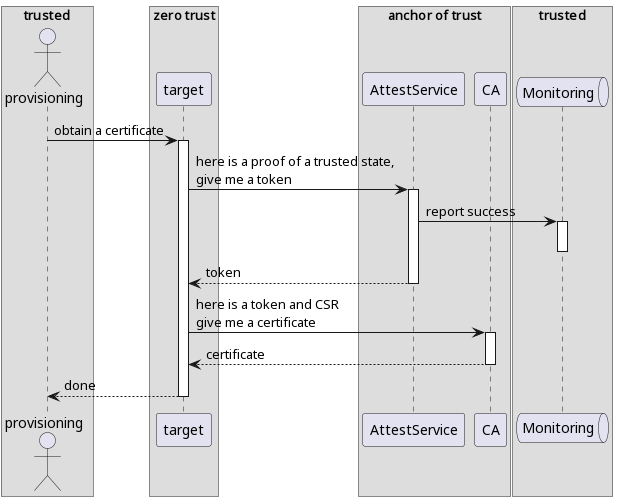
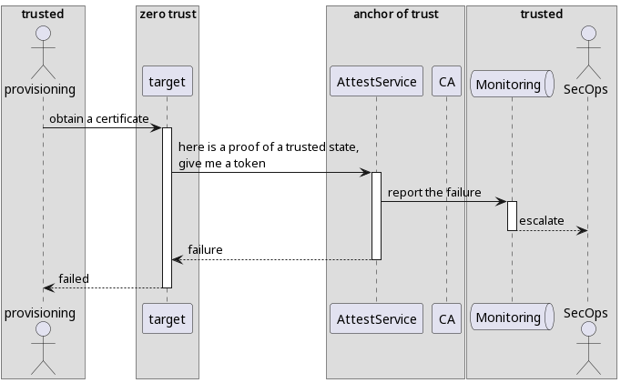
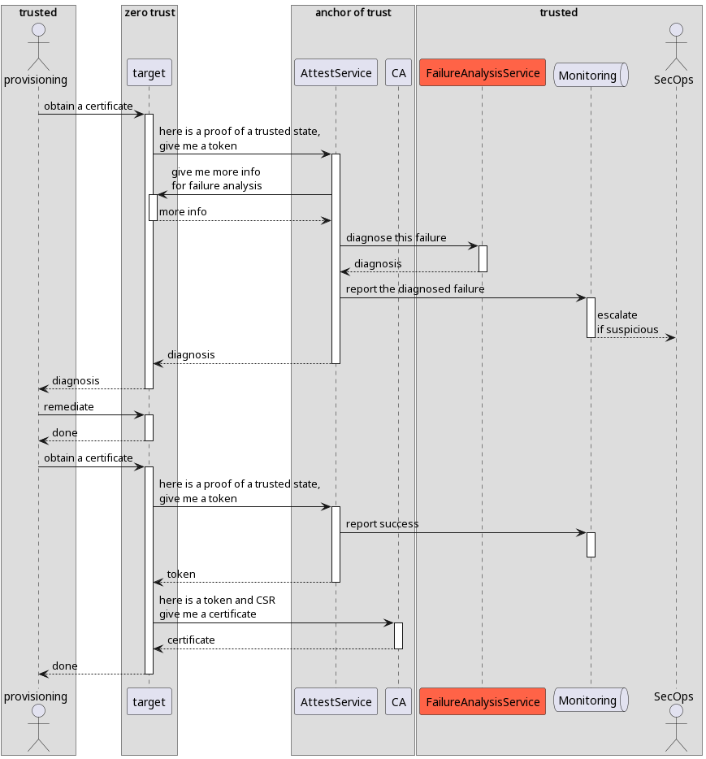
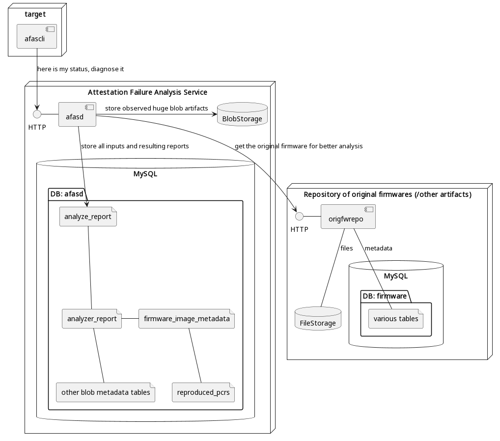

# `AttestationFailureAnalysisService`

## About

`AttestationFailureAnalysisService` is an extendible (dependency-injection focused) service tailored to provide machine readable reports, explaining why [Remote Attestation](https://en.wikipedia.org/wiki/Trusted_Computing#Remote_attestation) failed.

The initial purpose of this service is to automatically handle the red block in this diagram:


This service is not a production-ready magic solution of all of your problems with attestation, but rather a generic template reusable across different companies and attestation/provisioning flows. But the specifics of your attestation/provisioning flow requires an implementation.

## Use cases

### Remediation

Let's assume the successful attestation flow looks something like this:


In this case attestation failure would be something like this:


So any failure for any reason would require manual intervention to understand what exactly happened, does it require security escalation (and escalate if required), how to fix it, fix it and restart the process.

But with `AttestationFailureAnalysisService` the flow becomes something like this:


Thus it enables to automate handling of the attestation failures.

## How to use this project

### -- AttestationFailureAnalysisService --

To use this project you need to implement yourown analyzers (see examples in `pkg/analyzers`), and reimplement `pkg/server/controller` and `cmd/afasd`. The implementations of `controller` and `cmd/afasd` in this repository are just a hello-world example.

As part of `pkg/server/controller` re-implementation you might also want to re-implement interfaces:

```go
type DeviceGetter interface {
    GetDeviceByHostname(hostname string) (*device.Device, error)
    GetDeviceByAssetID(assetID int64) (*device.Device, error)
    // you may also re-define if/device.thrift
}

type originalFWImageRepository interface {
    DownloadByVersion(ctx context.Context, version string) ([]byte, string, error)
}
```

And as part of `cmd/afasd` re-implementation you might also want to re-implement interface:

```go
type BlobStorage interface {
    io.Closer
    Get(ctx context.Context, key []byte) ([]byte, error)
    Replace(ctx context.Context, key []byte, blob []byte) error
    Delete(ctx context.Context, key []byte) error
}
```

In result you will have yourown implementation of attestation failure analysis service, which is tailored to your attestation/provisioning flows. But the generic logic (like a generic API for analyzers) will be shared with other companies. You may also share specific analyzers with the public (similar to how some analyzers are published here).

You can copy the hello-world implementations provided here and start gradually change them in your repository. Additional references:

* [Here](https://github.com/facebookincubator/AttestationFailureAnalysisService/blob/main/pkg/server/controller/analyze.go#L116-L155) you can find a dispatcher of analyzers (when you will be reimplementing `controller`, this is the place where you can add yourown analyzers):
* And [here](https://github.com/facebookincubator/AttestationFailureAnalysisService/blob/main/pkg/server/controller/types/value_calculator.go#L19-L24) you can find an example how to add yourown DataCalculators.

### -- [`converged-security-suite`](https://github.com/9elements/converged-security-suite) --

The analysis of this service is supposed to be heavily dependent on the [`bootflow`](https://github.com/9elements/converged-security-suite/tree/f6a71d3e2098ea46983678ec1e74bfb1c45f82c2/pkg/bootflow) package of `converged-security-suite`. This package is designed to be dependency-injectable, so when implementing an [Analyzer](https://github.com/immune-gmbh/AttestationFailureAnalysisService/blob/main/pkg/analysis/types.go#L38-L42) feel free to define yourown [`Flow`](https://github.com/9elements/converged-security-suite/blob/f6a71d3e2098ea46983678ec1e74bfb1c45f82c2/pkg/bootflow/flows/root.go#L10-L14). `<...the documentation how to do that is to be developed...>`

## Design

### Components

`AttestationFailureAnalysisService` implies dependency injection of major components, and the resulting scheme could be different. But at average it could be something like this:


For dummy demonstration there is a [`docker-compose.yml`](./docker-compose.yml) file, which brings up a scheme similar to shown above, but there `afasd` accesses directly the `firmware` tables and uses `nginx` to access the `FileStorage` (for simplicity of the demonstration).
